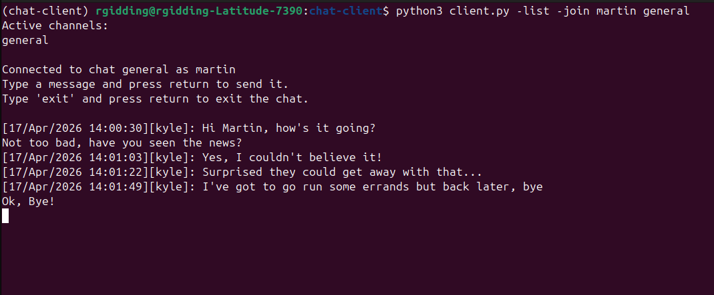

# Chat Client

## Introduction

A command line Python chat client to connect to the server [here](https://github.com/richardgiddings/chat-server).

## Getting Started

It is recommended to use a virtual environment to keep dependencies isolated to just this project.

Install the requirements:
```
pip install -r requirements.txt
``` 

Either add the following environment variables or put them in a .env file:
```
BASE_URL - the url for the Flask chat server e.g. http://127.0.0.1:5000
```

We can then run multiple chat clients from the command line using a command like:
```
python3 client.py -join <username> <chat_name>
```
where we replace the *username* with the name we want to be known as in the chat and *chat_name* with the chat we want to connect to.

If we want to see to see the active channels we can add the *-list* flag either on its own or with the above command to see the channels that have already been created.

## Screenshots

**User 1**


**User 2**

